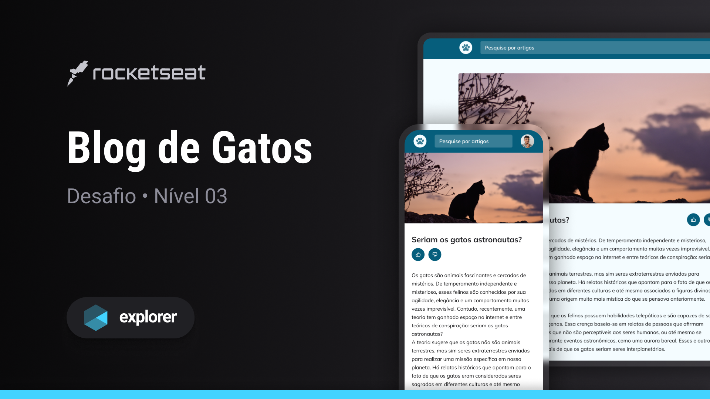

<h1 align="center"> Blog de gatos </h1>

Programa promovido no nível 3 da trilha Explorer da Rocketseat para ensino de tecnologias WEB. 

- [Acesse o projeto finalizado, online](https://blog-de-gatos-brs.vercel.app/)
  

  <a href="#-tecnologias">Tecnologias</a>&nbsp;&nbsp;&nbsp;|&nbsp;&nbsp;&nbsp;
  <a href="#-projeto">Projeto</a>&nbsp;&nbsp;&nbsp;|&nbsp;&nbsp;&nbsp;
  <a href="#-layout">Layout</a>&nbsp;&nbsp;&nbsp;|&nbsp;&nbsp;&nbsp;
  <a href="#memo-licença">Licença</a>

  

 

  

Desafio proposto durante a trilha Explorer da Rocketseat, para prática e reforço de importantes conceitos de HTML e CSS, os quais destacam-se: 

- Mobile first: Manter um design responsivo em telas menores para posteriormente ajustá-lo para uma versão desktop
- Unidades de medida flexíveis
- CSS Grid
- Variáveis CSS
- Cores HSL
- Animações e transições
  

## 🚀 Tecnologias

Esse projeto foi desenvolvido com as seguintes tecnologias:

- HTML
- CSS
- Figma

## 💻 Projeto

- 
A aplicação consiste em um Blog para os amantes de gatos, contendo diversas informações e imagens sobre os felinos.    

## 🔖 Layout

Você pode visualizar o layout do projeto através [DESSE LINK](https://www.figma.com/design/Ox9ZN37v7V7K563iWLvsG1/Blog-de-Gatos-%E2%80%A2-Desafio-Explorer-(Community)?m=auto&t=iscKhQS9FUvQus1k-6). É necessário ter conta no [Figma](https://figma.com) para acessá-lo.

## :memo: Licença

Esse projeto está sob a licença MIT.

---

Feito por Bernardo Sá :wave: [Participe da comunidade da Rocketseat!](https://discord.gg/rocketseat)